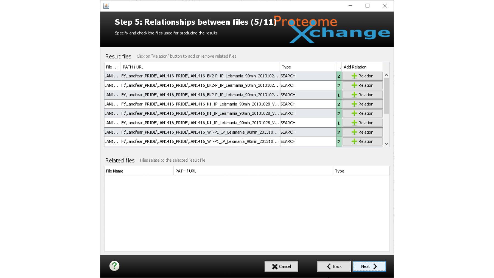

# PRIDE_submission_tutorial

A lighthearted guide to submitting proteomics data to PRIDE.

---

## Guide to PRIDE data submissions

## Phil Wilmarth

## OHSU PSR Core

### May 18, 2020

---

_Slide 1_ 
With more and more journals requiring mass spec data be placed in data repositories to submit manuscripts, you may find yourself struggling with an efficient workflow for ProteomeXchange data submissions. This guide is how I prepare the data and metadata for submissions.

---

_Slide 2_ 
ProteomeXchange is not PRIDE. There are several other repository options that can meet journal requirements. ProteomeXchange is kind of a centralized switchyard for data archives. I have only used PRIDE. There is a Java GUI application that you use for submitting data to PRIDE via ProteomeXchange. This guide will show you how to use that tool to make your data submission. You should do some reading at the links (listed below) to get some overview of what is to come.

- http://www.proteomexchange.org
- http://www.proteomexchange.org/submission/index.html
- https://www.ebi.ac.uk/pride/
- https://www.ebi.ac.uk/pride/markdownpage/pridesubmissiontool#submission_tool
- https://www.ebi.ac.uk/pride/markdownpage/submitdatapage#how_to_submit_data
-https://www.ebi.ac.uk/pride/static/markdown/submitdatapage/files/Submission_Tutorial.pdf

---

_Slide 3_ 
I always create a new folder for PRIDE submissions and copy all files for the submission into one place. This folder can be large. If space is a concern, almost all files will be copies and the folder can probably be deleted after the submission has been accepted. At that point, you will have copies of all the files at PRIDE anyway.

---

_Slide 4_ 
Chain of custody for data is a can of worms. In our core, we archive the data for the clients. The clients typically get the major results summaries that are much small than the total project size. We often need to iterate on the data analysis choices with the clients once they start looking over the results (you used the wrong species, you did not use our favorite protein database, you did not have our expressed protein construct’s sequence correct, you did not look for “my favorite PTM”, etc.). If we were to start with a full data handoff (of several GB of files) then redo analyses, we end up with a version control mess. It is also likely that an experiment did not work and will be repeated. What data files constitute “the experiment” starts to get complicated.

Our solution of holding back the nitty gritty stuff like the RAW files hides a lot of unnecessary details from the client. That comes back to bite you in the ass at manuscript submission time when you have to find the old files (and find the correct old files for the actual set of results being published). We have no control over what clients do with results files in the months to years that elapse between acquiring the data and submitting the manuscript. It helps to keep some notes about what files were sent to clients. It helps to have nice, informative, summary files so that there is less perceived need to change the files so extensively that you have trouble matching them to the original files.

For the data used in this example, some of the runs were from 2013 for a manuscript being submitted in 2020. That is on the longer time frame, for sure. We do see 3-5 years pretty frequently. That means that having to submit data to archives was not a requirement when the data was collected. You and your clients started the project in a different context than we have now. This will cause some confusion when submitting a manuscript and running into the roadblock of having to have a data archive reference in the manuscript. Get used to this. It is going to keep happening. Be professional.

---

_Slide 5_ 
Assuming that you have done thorough detective work and know what RAW files really go with the published data, you have to round up all of the intermediate files. RAW files are often processed to make peak list text files for input to search engines (like MGF files). Many newer search engines can read RAW files directly, so there may not be any peak list files.

There will be search results. What do we mean by search results? That is another can of worms. Most search engines (Comet, SEQUEST, Mascot, Andromeda, etc.) produce a list of peptide spectrum matches (PSMs) with some collection of search engine quantities. No one wants to look at PSM lists. They are noisy and not what the biologist wants. Some sort of post processing is used to get rid of the noise. That can take many forms. The target/decoy method or some other form of FDR control are commonly used. That is usually from other parts of the black box for all-in-one programs or from another pipeline step like Percolator. Filtered PSMs are nicer than unfiltered PSMs. But still not what anyone wants.

The next step is usually protein inference to turn a really long list of peptide sequences into a smaller list of proteins. Now we are getting into the biology realm. Quantitative studies have replaced "flag planting" discovery experiments (a.k.a. pissing contests – my list is bigger than your list. We should call those list waving experiments dickomics).

There will be many files to round up. You might forget some important ones – the FASTA file for the searches, the search program configuration file, etc. You might want to make a file key file, too.

---

_Slide 6_ 
The slide title here is probably the funniest joke in the presentation. Think of the data archive like the stone tablets with the 10 Commandments; they **are** literally set in stone. Before you submit the files is the time to double and triple check everything. This is also a major reason to make a separate folder for all of the files, so that the double checking is more efficient and the chance for mistakes is reduced. In quantitative experiments, the sample keys are essential. Think about someone else trying to figure out your experiment. What LC runs constitute the biological samples (did you have fractions?)? Do you have hidden sample dimensions (TMT channels, SILAC channels, etc.)? This is a little like comments in programming code. One of the more important people you write comments for is your future self.

> see https://pwilmart.github.io/blog/2020/06/07/Sample-keys for some more thoughts on proteomics metadata

---

_Slide 7_ 
Finding (and checking) all the data files is like the present that goes inside the box. The metadata is like the wrapping. The gift is not ready to go until the wrapping is done. You need the principle investigator details. You have to know something about the biology of the samples (species, tissue, cell type, disease, etc.). You have to define the pigeonhole to put the mass spec experiment into. There are some Methods-like details that are also required. You will want a copy of the manuscript draft at hand for the next steps.

---

_Slide 8_ 
You will have to fill in a web-like form with these details. The forms have character limits and do not allow special characters (or at least not easily). I like to make a Word file with these details. You can make use of the spelling and grammar checking, and the word and character counting tools. Copy/paste from the Word file when filling in the form is recommended. More and more manuscripts these days have experiments in addition to the mass spec parts. You do not need to describe anything except the mass spec parts of the study. What were the specific biological samples that were used in the mass spec experiment and how were they prepared. You may have details in your notebooks about how those samples were digested, cleaned up, run on the HPLC systems, and on the mass spec. You might want to compile this metadata at the time you send results to clients instead of years later.

---

_Slide 9_ 
You are finally up to attempting to make the actual submission. Will you stick the landing? If you have downloaded the latest version of the submission tool, you have to get it to run. Java is strange. It is property of Oracle (a big database company that acquired Sun Micro Systems). It seems kind of open source. It can have some security issues, usually from out-of-date versions. It may be installed and up-to-date on your system or it may not. You can try to launch the submission tool by double clicking or you can also use the command line. You may have to do some extra work to get Java up and running to get the submission tool launched.

---

_Slide 10_ 
When the tools starts up, the first thing is to login to PRIDE. Someone associated with with the submission needs to have a PRIDE account. You do not have to be a manuscript co-author to submit data to PRIDE, but you will have to take some responsibility for the submission.

---

_Slide 11_ 
The next step is what type of submission are you doing. The PAW pipeline does not make the kinds of standardized output files needed for complete submissions. Select the partial submission option. You will be scolded for being such a horrible person that would not do a complete submission. Keep a stiff upper lip, it will all be okay.

---

_Slide 12_ 
Tears are hard on your keyboard. Click yes and save your hurts feelings for your therapist or a cold beer.

---

_Slide 13_ 
This is the next screen. You just want to click on those cool, big buttons, don’t you? Well, they are not buttons. Sorry. Stay strong. Between the partial submission shaming and feeling like a fool for clicking on buttons that are not buttons, you may be ready to give up. Don’t worry, it gets harder! Click next.

---

_Slide 14_ 
Ah, here is why you created that Word file. If it is not already open, open it and get ready to copy/paste. Most widgets on this page are text entry forms. The bottom one is a pull-down menu that will let you select more than one thing. You may see ugly red highlighting if you have filled in an entry form with too few or too many characters. When everything is filled in and okay, click next.

---

_Slide 15_ 
Next, you upload all the files. Since you made a new folder with copies of the files you want to submit (right?), you just need to browser to that folder and select all the files.

---

_Slide 16_ 
This is the folder where I collected all the files for this submission. You might be able to select folders or open up the folder and select one or more files. You can keep selecting files in batches until you get everything. Putting everything in one folder helps make sure you do not forget any files.

For the PAW pipeline, the peak list files are the MS2 files. The Comet results are the SQT files. The top-hit summary files are TXT files. We have flavors of those files that are before or after FDR filtering. Only the filtered files are used for protein inference and/or quantification. They are smaller and what we need to submit. Various summary files for PSMs, peptides, and proteins should also be part of the submission. FASTA files, parameter files, log files, roadmap files, sample keys, readme files, etc. should also be part of the submission.

---

_Slide 17_ 
After you select the files, the list will show up. If you have long file names, you may need to resize the window and adjust column widths. The tool recognizes some file extensions like .FASTA and .RAW and then automatically puts those files into categories. The default is OTHER for file type. Each RAW file might have an associated PEAK list file (these are the filtered MS2 files in the PAW pipeline), there will be SEARCH results. You may have to manually assign files to their categories using the pull-down menu. Results summaries and quantification tables are best left as OTHER.

---

_Slide 18_ 
When you have the files in the correct categories, click next. Do not worry about the red highlighting.

---

_Slide 19_ 
A new (and very nice) feature is computing check sums to verify that the uploaded files made the trip in one piece. When it seems like it finished, wait a few minutes, then click next. It is quite aspirational. It did not quite give 110%, but the 103% is good enough for me.

---

_Slide 20_ 
Now we have one of the most confusing steps - defining the file relationships. This is really about what PEAK and SEARCH files go with which RAW files. Based on base file names, the relationships may be already correctly guessed. If not, you have to select a file in the top window, and then add related files in the bottom window. Each RAW file has to have some relationship to at least one other file(s) in the submission (PEAK and SEARCH files). When you have defined things, click next.

---

_Slide 21_ 
If we select a file in the top window and click the add relation button to its right, we get a dialog box.

---

_Slide 22_ 
The dialog box lets us check mark the related files, then click +Add.

---

_Slide 23_ 
Then we get those files in the bottom window. You can play around with the interface to see how it works. You can always cancel and start the whole submission over or go back some steps if you really screw things up.

---

_Slide 24_ 
This step lets you specify some controlled vocabulary terms in some categories. Not all categories are required. Some of the more common vocabulary terms are in the pull-down menus, other have to be searched for over the network. When you have everything that is relevant selected, click next.

---

_Slide 25_ 
Enter the information for the PI here and click next. The PI or Lab Head will be included in the emails about the progress of the submission. You may want to alert them that there will be a couple of emails headed their way. You get one confusing email after the data uploads successfully that basically just says the submission has been opened. After the submission has been checked over, it is either accepted or rejected. If it is accepted (yeah!), an email with the PXD number and instruction on how to reference the submission in your manuscript are communicated to you and the Lab Head.

---

_Slide 26_ 
This step is for special projects. Do not mess with anything and click next.

---

_Slide 27_ 
This is like the final order confirmation screen you get when you are ordering something online you don’t really need from some place you are too lazy to go to. What you see here should be what you had in your local submission folder. If you ignored that advice and have been adding files from all over your file system, you might want to check that you have everything selected that you need, and that file types and relations are all okay. You have to agree to the service terms (the little check box) so that PRIDE can sell all of your private data (ha-ha). Take a few deep breaths and then click submit.

---

_Slide 28_ 
The submission tool writes itself a record of what you did so that it can start over more gracefully if the actual file transfers fail (I love this feature!). I usually just click the save button.

---

_Slide 29_ 
You will get a progress bar for the actual file transfer step. This can take a long time to complete. The status indicator is a little flakey. There are two transfer protocols that the tool uses. Aspera is faster and that is used first. That does not always work. If it fails, FTP is used. You get a dialog box alert about that. However, the status information may not reset, so you may think nothing is happening. It is better to just wait (like, several hours or overnight) and see if it finishes.

---

_Slide 30_ 
If (or when) it finishes, you get the emoji screen. Be kind with your choice and click feedback. You did it!  

---

_Slide 31_ 
You get a coupled of emails right after you submit the archive. The archive will be private during manuscript review. Then the timing and fate is up to the journal. If and/or when the paper sees the light of day (gets DOI number, PubMed number, actual Journal citation details), then the archive should be made public. That often happens automatically or can be triggered by letting PRIDE know that the paper is out.

---

Thank you!  

-PW 20200707
